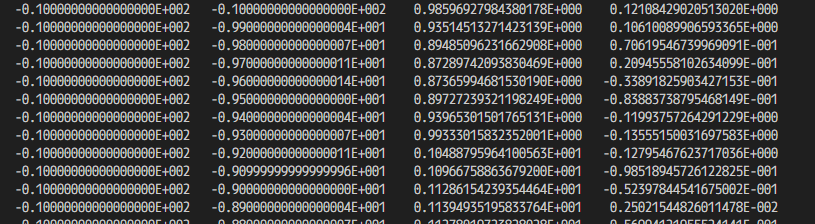
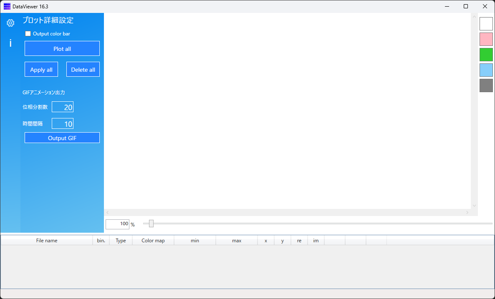
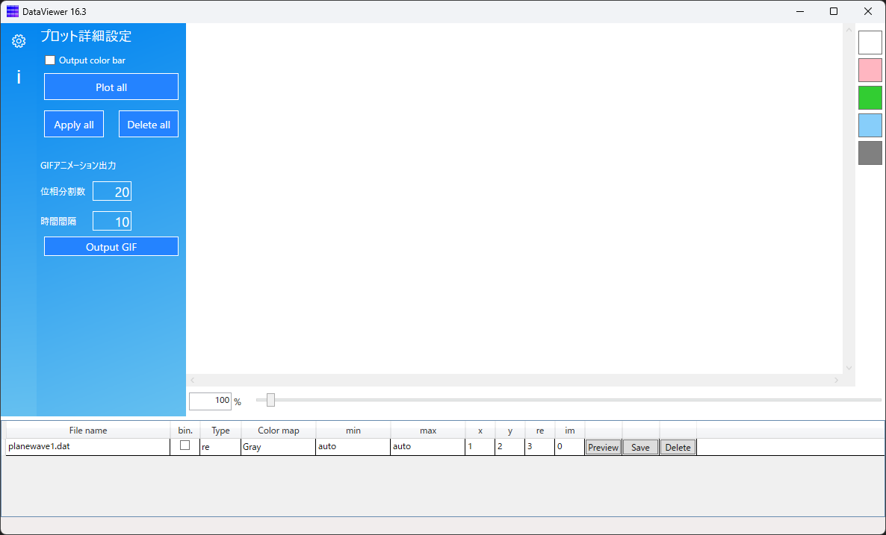
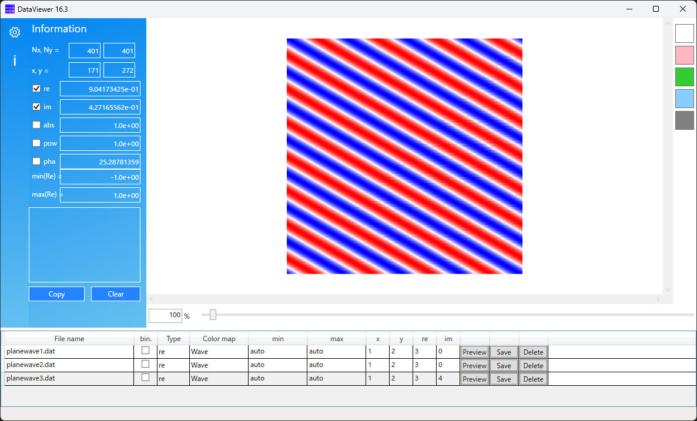

# DataViewer

2次元データ、特に複素表示の波動分布をプロットするソフトウェアです。

## 対象データ形式

テキストデータまたはバイナリデータを読み込み可能です。

### テキストデータ

タブ、コンマ、スペースのいずれかで区切られたテキストデータを読み込み可能です。
各列はx、y座標、(x,y)における値の実部、虚部を表します。
実部のみの実数データでも構いません。

### バイナリデータ

以下の順にバイナリ形式で保存します。
- データフォーマット：`format(int)`
	- `format=1`: type 1（常に1）
- 数値型：`ntype(int)`
	- `ntype=1004`: 4バイト整数型
	- `ntype=2000`: 倍精度浮動小数点型
	- `ntype=3000`: 倍精度複素数型
- 配列の次元: `dim(int)`
	- `dim=2`: 2次元（2次元データのみ対応するため常に2）
- プロット点数(横方向): `Nx(int)`
- プロット点数(縦方向): `Ny(int)`
- データ本体：
	- `ntype=1004,2000`の場合
      - `data[0,0]`
      - `data[1,0]`
      - `data[2,0]`
      - ・・・
      - `data[Nx-1,0]`
      - `data[0,1]`
      - `data[1,1]`
      - `data[2,1]`
      - ・・・
      - `data[Nx-1,1]`
      - `data[0,2]`
      - `data[1,2]`
      - `data[2,2]`
      - ・・・
      - `data[Nx-1,2]`
      - ・・・
      - `data[Nx-1,Ny-1]`
	- `ntype=3000`の場合
      - `data[0,0](実部)`
      - `data[0,0](虚部)`
      - `data[1,0](実部)`
      - `data[1,0](虚部)`
      - `data[2,0](実部)`
      - `data[2,0](虚部)`
      - ・・・
      - `data[Nx-1,0](実部)`
      - `data[Nx-1,0](虚部)`
      - `data[0,1](実部)`
      - `data[0,1](虚部)`
      - `data[1,1](実部)`
      - `data[1,1](虚部)`
      - `data[2,1](実部)`
      - `data[2,1](虚部)`
      - ・・・
      - `data[Nx-1,1](実部)`
      - `data[Nx-1,1](虚部)`
      - `data[0,2](実部)`
      - `data[0,2](虚部)`
      - `data[1,2](実部)`
      - `data[1,2](虚部)`
      - `data[2,2](実部)`
      - `data[2,2](虚部)`
      - ・・・
      - `data[Nx-1,2](実部)`
      - `data[Nx-1,2](虚部)`
      - ・・・
      - `data[Nx-1,Ny-1](実部)`
      - `data[Nx-1,Ny-1](虚部)`

## 使い方

### データの読み込み

1. DataViewerを起動します。

※初めて起動する場合は「`作業フォルダ「C:\DataViewerWorkSpace」を作成してもよろしいですか？`」と表示されます。「はい」をクリックすると、ソフトが使用可能になります。

2. データファイルを下のリストにドラッグ＆ドロップします。（複数のファイルをまとめて登録可能）

3. 必要に応じて、プロット設定を変更します
  - bin.：
    - バイナリ形式の場合、チェックする
  - Type：
    - re：実数データをそのままプロット。複素数データの場合は、実部をプロット
    - im：複素数データの虚部をプロット（複素数データのみ指定可能）
    - abs：複素数データの絶対値をプロット（複素数データのみ指定可能）
    - pha：複素数データの偏角をプロット（複素数データのみ指定可能）
    - pow：複素数データの絶対値の2乗をプロット（複素数データのみ指定可能）
    - cpx：複素数データのプロット（複素数データのみ指定可能、カラーマップComplexLight、ComplexVividのみ有効）
  - min：カラーマップの下限色に対応する数値を指定します
  - max：カラーマップの上限色に対応する数値を指定します
  - x：x座標が記されたデータ列(テキスト形式のみ有効)
  - y：y座標が記されたデータ列(テキスト形式のみ有効)
  - re：プロットする値（複素数の場合は実部）が記されたデータ列(テキスト形式のみ有効)
  - im：プロットする値の虚部が記されたデータ列（複素数でない場合は0を指定、テキスト形式のみ有効）
  - Color map
    - カラーマップを選択

### プレビューと保存

- \[Preview\]をクリックするとプロット結果が画面に表示されます（データファイルが書き換えられた場合はもう一度押すと更新）
- \[Save\]をクリックすると、データファイルと同じ場所にbmpファイルが出力されます。
- \[Delete\]をクリックすると選択した項目を削除します。

#### プロット詳細設定

- \[Output color bar\]をチェックした上で\[Plot\]をクリックすると、bmpファイルと同時にカラーバーのbmpファイルも出力されます。
- \[Plot all\]をクリックすると、下のリスト内のファイルがすべてプロットされ、データファイルと同じ場所にbmpファイルが出力されます。
- \[Apply all\]をクリックすると、選択されたデータ項目のプロット設定が他のすべての項目に反映されます。
- \[Delete all\]をクリックすると、リストのデータ項目をすべて削除します。

#### GIFアニメーション出力

複素数データに$\exp(j\omega t)$を掛けて$t$を変えながら実部をプロットし、アニメーションを出力します。
- 位相分割数：位相変化$0$～$2\pi$の間のフレーム数
- 時間間隔：フレーム間の時間間隔(ms)

### Information

左のサイドメニューから「Information」を開くと、マウスのカーソル位置の座標と値が表示されます。
複素数データの場合は、虚部、絶対値、絶対値の2乗、偏角も表示されます。
マウスをクリックすると、その位置の値がテキストボックスに追加されます。

